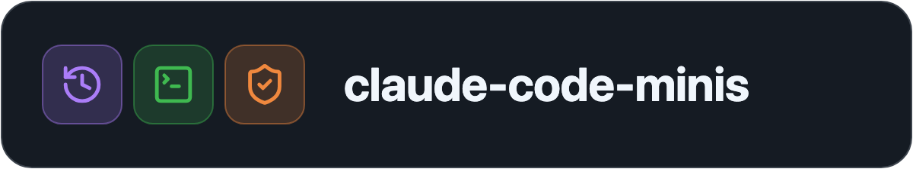
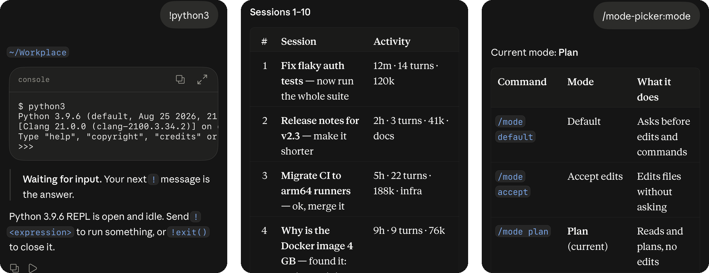

<p align="center">
  
</p>

<p align="center">
  <b>Small, focused plugins for Claude Code.</b><br>
  Each one does one job. Install only the ones you want.
</p>

<p align="center">
  <a href="LICENSE"></a>
  
  <a href="https://ethbak.github.io/claude-code-minis/"></a>
</p>

<p align="center">
  <a href="#-plugins">Plugins</a> ·
  <a href="#-install">Install</a> ·
  <a href="#-faq">FAQ</a>
</p>

<p align="center">
  
</p>

---

## 🧩 Plugins

<table>
  <tr>
    <td width="64" align="center">
      <picture><source media="(prefers-color-scheme: dark)" srcset="assets/remote-resume-icon-dark.png"></picture>
    </td>
    <td>
      <a href="plugins/remote-resume"><b>remote-resume</b></a> &nbsp;<code>/rresume</code><br>
      Find and resume any Claude Code session from the Claude app, including archived chats and terminal sessions. Uses no tokens.
    </td>
  </tr>
  <tr>
    <td width="64" align="center">
      <picture><source media="(prefers-color-scheme: dark)" srcset="assets/remote-terminal-icon-dark.png"></picture>
    </td>
    <td>
      <a href="plugins/remote-terminal"><b>remote-terminal</b></a> &nbsp;<code>!</code><br>
      Run shell commands on your computer from the Claude app. Interactive, unlike Claude Code's own <code>!</code>: answer prompts, type passwords, press Ctrl-C.
    </td>
  </tr>
  <tr>
    <td width="64" align="center">
      <picture><source media="(prefers-color-scheme: dark)" srcset="assets/mode-picker-icon-dark.png"></picture>
    </td>
    <td>
      <a href="plugins/mode-picker"><b>mode-picker</b></a> &nbsp;<code>/mode</code><br>
      Switch to any permission mode from your phone, including Auto and Bypass permissions. Costs no tokens.
    </td>
  </tr>
</table>

## 📦 Install

Add the marketplace once:

```
/plugin marketplace add ethbak/claude-code-minis
```

Then install the plugins you want:

```
/plugin install remote-resume@claude-code-minis
/plugin install remote-terminal@claude-code-minis
/plugin install mode-picker@claude-code-minis
```

Every plugin runs on macOS and Linux with Python 3. A plugin page lists anything else it needs, and Claude offers to install what is missing.

## ✨ Features

- **One job each.** Every plugin installs on its own and depends on no other plugin.
- **Few dependencies.** Python 3 covers most plugins. When one needs more, like remote-terminal's `tmux`, Claude offers to install it.
- **No tokens for plugin replies.** When a plugin can answer by itself, it skips the Claude turn.
- **Same on macOS and Linux.**

## ❓ FAQ

<details>
<summary><b>Can I resume a Claude Code session from my phone?</b></summary>

Yes, with [remote-resume](plugins/remote-resume). Type `/rresume` in the Claude app to list your sessions, then `/rresume 3` to resume the third.

</details>

<details>
<summary><b>Can I run shell commands from the Claude app?</b></summary>

Yes, with [remote-terminal](plugins/remote-terminal). Start a message with `!`, for example `!git status`, and the output comes back in the chat.

</details>

<details>
<summary><b>How do I use Bypass permissions or Auto mode from the Claude app?</b></summary>

Install [mode-picker](plugins/mode-picker), then type `/mode bypass` or `/mode auto`.

</details>

## 🤝 Contributing

I built these for myself and use them every day, and I'm sharing them in case they help you too. If you have a small Claude Code plugin that fits here, or a fix for one of these, open an issue or a pull request. A good fit does one job, works on macOS and Linux, and needs little beyond Python 3.

## 📄 License

[MIT](LICENSE).
