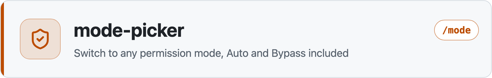
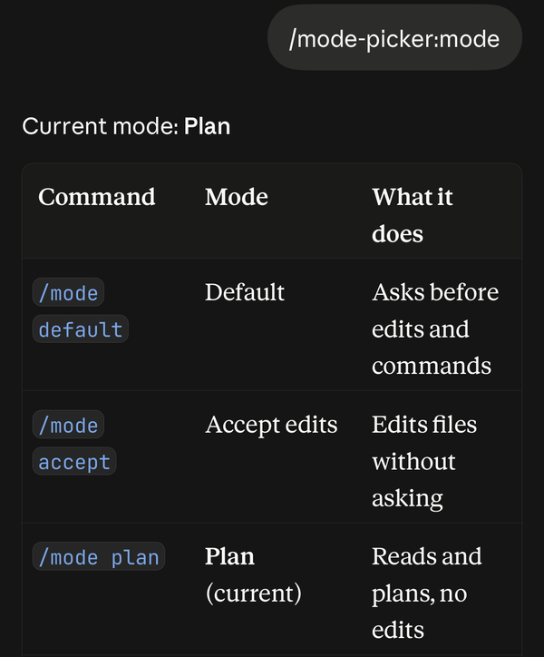
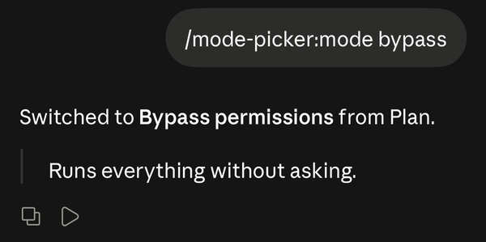

<picture>
  <source media="(prefers-color-scheme: dark)" srcset="../../assets/mode-picker-header-dark.png">
  
</picture>

# mode-picker: change permission mode in Claude Code Remote Control

<p align="center"></p>

`/mode` switches a [Remote Control](https://code.claude.com/docs/en/remote-control) session to any of Claude Code's six permission modes from the Claude app. For Remote Control, the app's mode menu offers at most Manual, Accept edits and Plan, and [never Auto or Bypass permissions](https://code.claude.com/docs/en/permission-modes).

When a long task from your phone stops at every step to ask permission, send `/mode bypass` or `/mode auto`.

> [!TIP]
> Part of [claude-code-minis](../..), small, focused plugins for Claude Code.

> [!IMPORTANT]
> **Bypass permissions and Auto from your phone, with no tokens.** The plugin sends the switch and writes the reply itself, without a Claude turn.

## ✨ Features

<p align="center"></p>

- 🎚️ **All six permission modes**, including Auto and Bypass permissions.
- ✅ **Confirmed switches**: the reply says "Switched" only after the session confirms the change, and says why if it refuses.
- 🔄 **Stays in sync** with claude.ai and the app, because it sends the same request the app's mode menu does.

## ⚖️ Compared with the app's mode menu

| Mode | App menu | `/mode` |
|---|:---:|:---:|
| Default (Manual) | Yes | Yes |
| Accept edits | Yes | Yes |
| Plan | Yes | Yes |
| Auto | No | Yes |
| Don't ask | No | Yes |
| Bypass permissions | No | Yes |

## 📦 Install

```
/plugin marketplace add ethbak/claude-code-minis
/plugin install mode-picker@claude-code-minis
```

## 🚀 Usage

| You type | Mode | What it means |
|---|---|---|
| `/mode default` | default | Ask before edits and commands |
| `/mode accept` | acceptEdits | Edit files without asking |
| `/mode plan` | plan | Read and plan, no edits |
| `/mode auto` | auto | A classifier reviews actions instead of you |
| `/mode dontask` | dontAsk | Deny anything not pre-approved |
| `/mode bypass` | bypassPermissions | Run everything without asking |
| `/mode` | | Show the current mode and this list |

> [!NOTE]
> Claude Code's own policy still applies. If an administrator disabled bypass mode for your account or organization, `/mode bypass` replies with the reason and leaves the mode as it was.

## 🩺 Troubleshooting

<details>
<summary><b>"Mode not changed"</b></summary>

The session refused the switch. Its reason is in the reply, most often a policy that disables that mode.

</details>

<details>
<summary><b>"Not confirmed"</b></summary>

The plugin sent the switch, but the session gave no answer within 15 seconds, usually because the connection dropped. Check the mode shown in the app, and send `/mode` again if it did not change.

</details>

<details>
<summary><b>My <code>/mode</code> went to Claude as text</b></summary>

- **The chat started before you installed the plugin.** Open a new chat.
- **You sent it while Claude was replying.** Wait for the reply to finish, then send it again.

</details>

## 🗑️ Uninstall

```
/plugin uninstall mode-picker@claude-code-minis
```

## ❓ FAQ

<details>
<summary><b>How do I turn on plan mode from the Claude app?</b></summary>

Type `/mode plan` in the Remote Control chat.

</details>

<details>
<summary><b>How do I enable bypass permissions in Remote Control?</b></summary>

Type `/mode bypass`. If bypass mode is disabled for your account or organization, the reply says so.

</details>

<details>
<summary><b>Does it work in a terminal session?</b></summary>

In a terminal, use Shift+Tab or `--permission-mode`; `/mode` tells you so.

</details>
